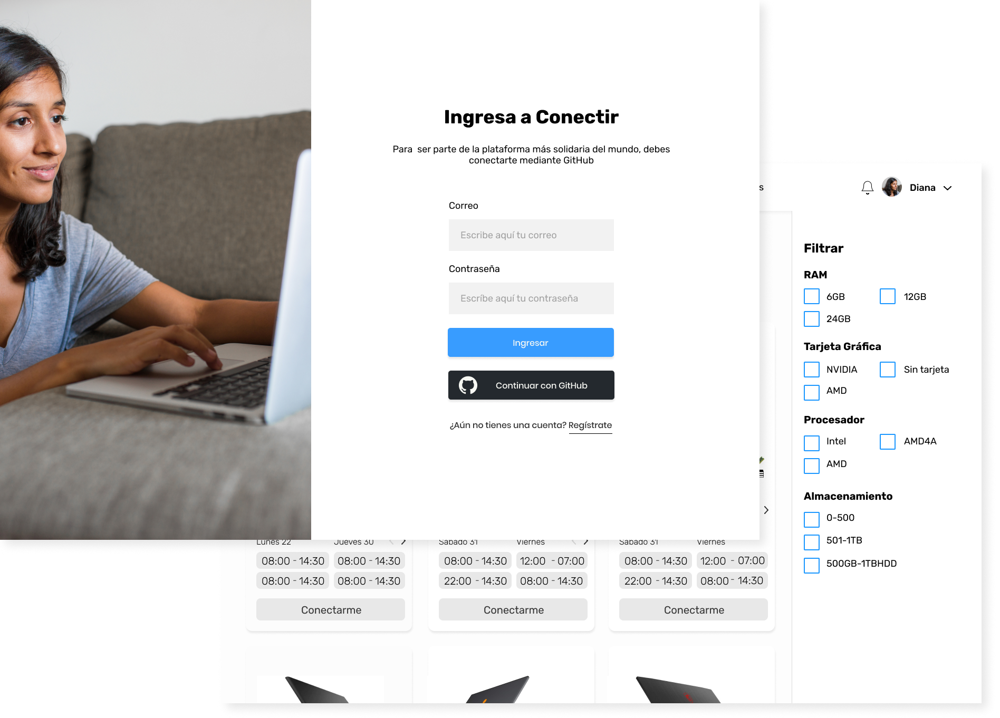

# Pasos para ejecutar el proyecto
1. Instalar las dependencias y las dependecias de desarrollo con el siguiente comando

    ``` 
    $ npm install 
    ``` 
   
2. Correr el proyecto con el siguiente comando
    ``` 
    $ npm run start 
    ```
    

# Comandos

### Start
Este comando ejecuta el proyecto en modo desarrollo. El proyecto corre en el puerto 8080
``` 
$ npm run build
```

### Build
Este comando construye el proyecto optimizado para producción y genera la carpeta **"build"**
``` 
$ npm run build
```

***

# Estilos

### Colores
Los colores están almacenados en el archivo **styleTitle.css** que está en la ruta `src/assets/styles` y son los siguientes:
        
- --color-blue: **#389CFF**;
- --color-black: **#000000**;
- --color-white: **#ffffff**;
- --color-gray-light: **#F2F2F2**;
- --color-gray-dark: **#A1A1A1**;
- --main-color: **var(--color-blue)**;
- --color-blue-hover: **rgb(37, 114, 192)**;
- --main-color-hover: **var(--color-blue-hover)**;

### Fuentes
Las fuentes, tamaños y estilos están almacenados en el archivo **styleTitle.css** que está en la ruta `src/assets/styles` y son los siguientes:

##### Fuente

La fuente es Rubik Font, y es parte de la colección de fuentes de Google 
https://fonts.googleapis.com/css2?family=Rubik:wght@400;500;700&display=swap

##### Tamaños
Dentro del proyecto se están manejando 4 tamaños
- --h1-size: **32px**;
- --h2-size: **20px**;
- --h3-size: **18px**;
- --regular-size: **18px**;

#### Estilos
Se están manejando 3 estilos diferentes:

- --h1-weight: **700**;  /* Bold */
- --h2-weight: **700**; /* Bold */
- --h3-weight: **700**; /* Bold */
- --medium-weight: **500**; /* Medium */
- --regular-weight: **400**; /* Regular */mar

***

# Componentes

En el proyecto hay 3 tipos de componentes:
- Elementos 
- Componentes
- Vistas
- 
***
#### Elementos
Dentro de los elementos se encuentran todas los átomos del proyecto como lo son los input, buttons, entre otros. Todos están siendo manejados con hooks y propiedades y a su vez todos se encuentran estilados y separados por estados. Por 

##### Buttons

**Button Principal**


**Button Secundario**


**Button Disabled**


**Button Personalizado**


Todos estos botones reciben los siguientes parámetros:

- **title**: Este parámetro esta relacionado con el texto que se mostrará dentro del botón
- **type**: Este parámetro recibe *"active"*, *"secundary"*, *"disabled"*
- **data**: Este parámetro recibe *"default"* para mostrar el botón principal, secundario o disabled. Recibe "*github*" para mostrar el botón de github.
- **redirect**: Este parámetro es opcional, recibe la ruta a donde se quiere rediriger al hacer click

```
Para configurar un boton como el de github pero con diferentes estilos y contenidos, es necesario retornar dentro de la condición ternaria un bloque de html diferente con otros estilos
```

##### Inputs

**Input Vacio**


**Input con Contenido**


Todos estos inputs reciben los siguientes parámetros:

- **title**: Este parámetro es el titulo del label que tendrá el input
- **type**: Este parámetro recibe los diferentes tipos de input de escrítura como *"text"*, *"number"*, *"password*", *"phone*", *"email*", *etc*
- **placeholder**: Este parámetro es el texto que se mostrará como placeholder.
- **value**: Este parámetro es el valor que tendrá el input para mantener la consistencia. Aquí se introduce el valor del hook donde se almacenerá la información
- **exportValue**: Este parámetro recibe la función *set* del hook que está almacenando la información

***
#### Componentes
Dentro de los componentes se encuentran el conjunto de átomos que forma una sección del sitio, como por ejemplo lo es el *header*, *footer*, *content*, *etc*.

***
#### Vistas
Dentro de las vistas se encuentra el conjunto de componentes que construye el *main* de de una de las páginas del sitio